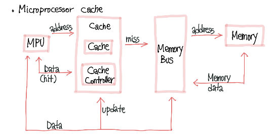

# Microprocessor cache
> 중앙처리장치(CPU)와 주 메모리 간의 속도 차이를 극복하여 컴퓨터 프로세서 속도 향상을 위한 작고 빠른 메모리 영역
> 

- mpu : Microprocessor Unit의 약자, CPU내에 포함된 작은 마이크로프로세서
- 프로세서 : 명령어를 해석하고 실행하여 프로그램이나 작업을 수행, 주로 CPU로 알려져있음
- 마이크로프로세서 : CPU의 핵심 부분을 구성하는 작은 실리콘 칩, 그것을 포함하는 IC
   1. 명령어 해석
   2. 산술 및 논리 연산
   3. 데이터 처리
   4. 제어
   5. 레지스터
   

# Virtual Memory(가상 메모리)
> 컴퓨터 시스템에서 주 메모리(RAM)를 보조로 사용하는 기술.
> 주 메모리의 용량 한계나 특정 프로세스의 메모리 요구를 초과하는 경우에 활용.

- MMU(Memory Management Unit) : 주 메모리와 프로세스 간의 상호 작용을 관리하는 장치.
    1. 주소 변환 : 논리주소(virtual address)를 물리주소(physical address)로 변환. 프로세스 간 충돌 방지, 각각의 프로세스에게 독립적인 메모리 공간 제공
    2. 메모리 보호
    3. 메모리 할당과 해제

- 논리 주소는 프로세스가 사용하는 주소, 물리 주소는 실제 메모리에서 데이터가 저장되는 위치

- Page Table : 페이지 테이블은 각 페이지에 대응하는 물리 프레임의 주소를 저장하고 있습니다.
  

# TLB (Translation Look-aside Buffer)
>  페이지 테이블의 일부를 캐시하는 작은 고속 메모리입니다. 주로 메모리 관리를 향상시키고 가상 주소를 물리 주소로 변환하는 데 사용됩니다. 
    1. 빠른 주소 변환(translate)
    2. 성능 향상 - 주 메모리 접근 횟수를 줄여 찾는 시간 단축
    3. 에너지 절약 - 주 메모리 접근 횟수를 줄여 전력 소모 줄임

> 일부를 캐시하다 : 빈번하게 사용되는 데이터나 정보를 더 빠르게 접근할 수 있도록 저장하는 것을 의미합니다.

