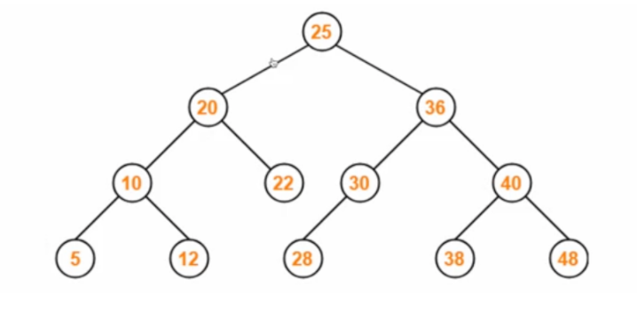

# 비선형 자료 구조
> 일렬로 나열하지 않고 자료 순서나 관계가 복잡한 구조를 말한다.

> 트리구조나 그래프구조가 대표적

## 그래프
- 정점과 간선으로 이루어진 자료 구조

### 정점과 간선
> 어떠한 곳에서 어떠한 곳으로 무언가를 통해 간다고 했을 때 '어떠한 곳'은 `정점(verrtex)`이 되고 '무언가'는 `간선(edge)`이 됩니다.
- 정점 ----(간선)---- 정점----(간선)----정점 -> 그래프

## 트리
- 트리는 그래프 중 하나로 그래프의 특징처럼 정점과 간선으로 이루어져 있고, 트리 구조로 배열된 일종의 계층적 데이터의 집합
- 루트 노드, 내부 노드, 리프 노드 등으로 구성
- 트리로 이루어진 집합을 숲이라 함
- 간선(E) = 노드(V) - 1

### 루트 노드
- 가장 위에 있는 노드

### 내부 로드
- 루트 노드와 내부 노드 사이에 있는 노드

### 리프 노드
- 자식 노드가 없는 노드


```python
#루트 노드       1
#내부 노드     2  3
#            4   5  8
#리프 노드      6 7  9 10
```

### 트리의 높이와 레벨
- 깊이 : 루트 노드부터 특정 노드까지 최단 거리로 갔을 때의 거리, 4번 노드의 깊이는 2
- 높이 : 루트 노드부터 리프 노드까지 거리 중 가장 긴 거리를 의미, 앞 그림에서 높이는 3
- 레벨 : 깊이와 같은 의미를 가짐, 1번 노드 = 0레벨, 2번과 3번 노드 = 1레벨 / 1번이 1레벨이면 2번,3번이 2레벨


## 이진 트리
- 자식의 노드 수가 두 개 이하인 트리를 의미


- 정이진 트리(full binary tree) : 자식 노드가 0 또는 두개인 이진 트리
- 완전 이진 트리(complete binary tree) : 왼쪽에서부터 채워져 있는 이진 트리, 마지막 레벨을 제외하고 모든 레벨이 채워져 있다.
- 변질 이진 트리(degenerate binary tree) : 자식 노드가 하나밖에 없는 이진 트리를 의미
- 포화 이진 트리(perfect binary tree) : 모든 노드가 꽉 차 있는 이진 트리를 의미
- 균형 이진 트리(balanced binary tree) : 왼쪽과 오른쪽 노드의 높이 차이가 1 이하인 이진 트리를 의미

### 이진 탐색 트리(BST)
- 노드의 오른쪽 하위 트리에는 '노드 값보다 큰 값'이 있는 노드만 포함
- 노드의 왼쪽 하위 트리에는 '노드 값보다 작은 값'이 들어있음
- 왼쪽, 오른쪽 하위트리도 해당 특성을 가짐
- 왼쪽은 작은 값, 오른쪽은 큰 값
- 보통 탐색에 O(logn)
- 선형적으로 구성될 때 시간 복잡도가 O(n)으로 커지는 문제점이 존재
  



### AVL 트리
- 스스로 균형을 잡는 이진 탐색 트리
- 탐색, 삽입, 삭제 모두 시간 복잡도가 O(logn)
- 삽입, 삭제를 할때마다 균형이 맞지 않는 것을 맞추기 위해 트리 일부를 왼쪽 혹은 오른쪽으로 회전시키며 균형을 잡음
- 두 자식 서브트리의 높이는 항상 최대 1만큼 차이

  


### 레드 블랙 트리
- 균형 이진 탐색 트리
- 탐색, 삽입, 삭제 모두 O(logn)
- 모든 리프 노드, 루트 노드가 블랙이고 어떤 노드가 레드면, 그 노드의 자식은 블랙이다.
  


## 힙
- 완전 이진 트리 기반의 자료구조
- 최소힙, 최대힙 두가지가 있다

최대힙 : 루트 노드에 있는 키는 가장 커야 합니다. 또한, 각 노드의 자식 노드와의 관계도 이와 같은 특징이 재귀적으로 이뤄짐


최소힙 : 루트 노드에 있는 키는 가장 최솟값이어야 합니다. 또한, 각 노드의 자식 노드와의 관계도 이와 같은 특징이 재귀적으로 이뤄짐


## 우선순위 큐
- 우선순위 대기열이라고도 하며, 대기열에서 우선순위가 높은 요소가 먼저 제공되는 자료 구조


## 맵
- 특정 순서에 따라 키와 매핑된 값의 조합으로 형성된 자료 구조
- 레드 블랙 트리 자료 구조를 기반으로 형성
- 삽입하면 자동 정렬
- map<string, int> 형태로 구현

## 셋
- 특정 순서에 따라 고유한 요소를 저장하는 컨테이너
- 중복되는 요소는 없고 오로지 단 하나의 값(희소한 값)만 저장하는 자료 구조

## 해시 테이블
- 무한에 가까운 데이터들을 유한한 개수의 해시 값으로 매핑한 테이블
- 삽입, 삭제, 탐색 시 평균적으로 O(1)의 시간 복잡도를 가짐
- 이를 통해 작은 크기의 캐시 메모리로도 프로세스를 관리 가능